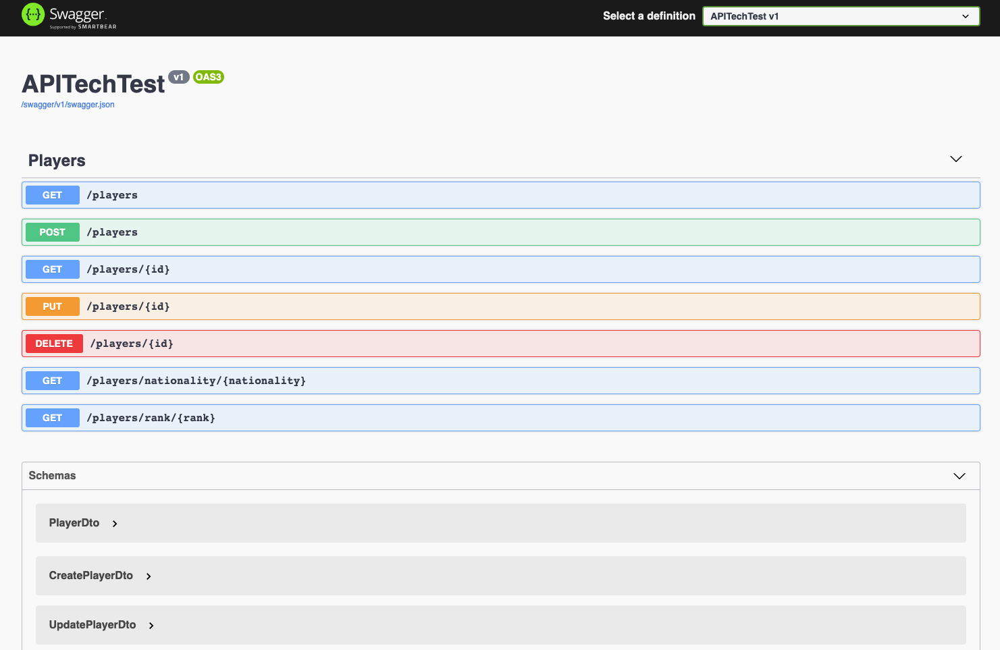

# API Tech Test - Tennis API

You are the president of the local Tennis Club.\
Your responsibilities include managing its players and their rankings.\
You’ve been asked to prepare an API (using the ASP.NET Core Web API technology) consisting of the following endpoints:

1. An endpoint for registering a new player into the club ✅
- The only required data for registration is the player’s first name and last name, nationality and\
 date of birth ✅
- No two players of the same first name and last name can be added ✅
- Players must be at least 16 years old to be able to enter the club ✅
- Each newly registered player should start with the score of 1200 points for the purpose of the ranking ✅

2. An endpoint listing all players in the club ✅
- It should be possible to list only players of a particular nationality and/or rank name (see below)\
 or all players ✅

**Rank** | **Points**
--- | ---
Unranked | (the player has played less than 3 games)
Bronze | 0 - 2999
Silver | 3000 - 4999
Gold | 5000 - 9999
Supersonic Legend | 10000 - no limit


- The list should contain the following information for every player:
 - the current position in the whole ranking - (work in progress)❌
 - first and last name ✅
 - age ✅
 - nationality ✅
 - rank name ✅
 - points ✅
- The players should be ordered by points (descending) ✅
 - The unranked players should also be ordered by points (descending) but should appear at the bottom of the list, below all other ranks ✅

## To Implement:
3. An endpoint for registering a match that has been played
- It should require to provide the winner and the loser of the match
- The loser gives the winner 10% of his points from before the match (rounded down)
 - For example, if Luca (1000 points) wins a match against Brendan (900 points), Luca should end up with 1090 points after the game and Brendan with 810
 - If Daniel (700 points) wins a match against James (1200 points), Daniel should end up with 820 points after the game and James with 1080
- The business logic behind calculating new player scores after a match should be unit-tested

4. **Database** - To obtained an MVP of my project to present on time, I decided to use an "InMemoryRepository" for tennis players. I will implement a simple MongoDB repository after completing point 3.
5. To extract logic from the player-controller, such as the function to check uniqueness First Name/Last Name and function to check minimum age allowed ✅

How to Run the API(Locally)
----
```
1. Type on the command line: git clone https://github.com/francescoFH/tennis-api.git
2. Open the project on VisualStudioCode (C# and Chrome debugger extensions must be installed)
3. Run Build Task (press SHIFT+COMMAND+B)
4. Run the project (press F5)
5. This url will be displayed: https://localhost:5001/swagger/index.html - (swagger UI)
```

